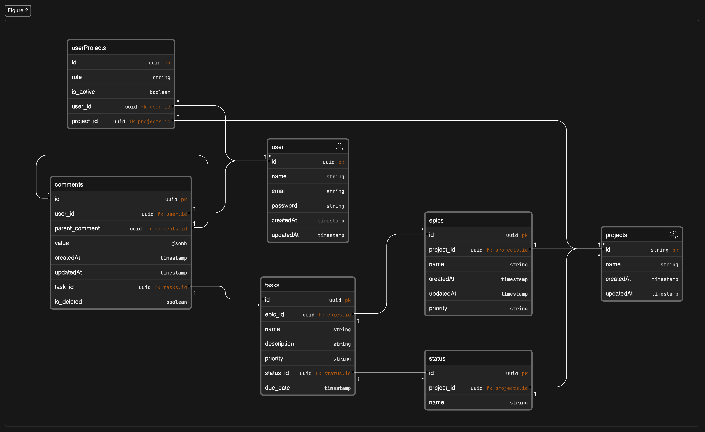

# Go Project Management App

This is a sample Go REST API using Gin and Gorm for a project management app.
## ERD Diagram

## Available Endpoints

### Users

1. POST `/users/register`
2. POST `/users/login`
3. GET `/users/profile`
4. DELETE `/users/:id`
5. GET `/users/:id`

### Projects

1. POST `/projects`
2. PUT `/projects/:id`
3. GET `/users/:id/projects`
4. GET `/projects/:id`
5. DELETE `/projects/:id`

### Tasks

1. POST `/projects/:id/tasks`
2. GET `/projects/:id/tasks`
3.
